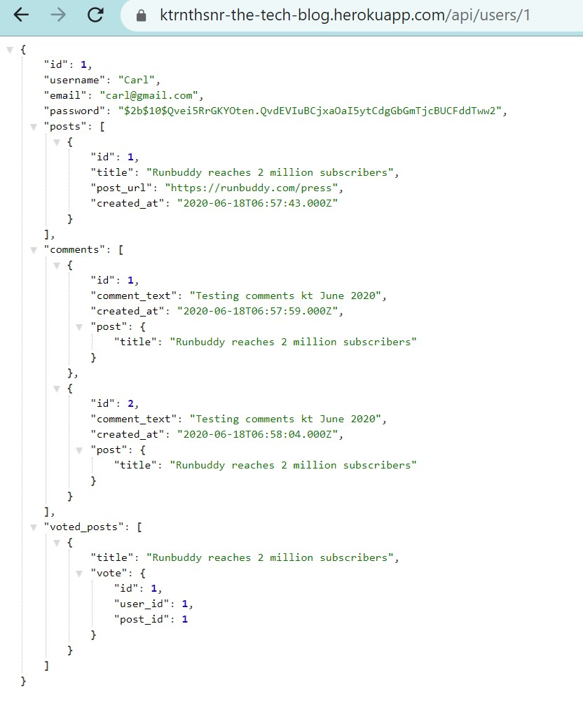

# The Tech Blog
This Node.js based blog website is an interactive application where users can post, upvote, and comment on each other's tech posts. 

## GitHub URL
https://github.com/ktrnthsnr/The-Tech-Blog

## Heroku
https://ktrnthsnr-the-tech-blog.herokuapp.com

## Table of Contents
* [Description](#description)
* [Technology](#technology)
* [Installations](#installations)
* [Usage](#usage)
* [Testing](#testing)
* [Userstory](#Userstory)
* [Contribution](#contribution)

## Description
- The blog is a content managemennt system deployed to Heroku in a mysql JawDB add-on, table models created through Sequelize JavaScript, and the HTML is dynamically generated by the template engine express-handlebars.
- Started building via the back-end, the work for this project contains JavaScript configuration, MySQL2 commands, and Sequelize model scripts that query the backend database tables.
- Sequelize is a JavaScript library and a Promise based Node.js object relational mapping (ORM) package that acts as a dialect to various SQL server software like MySQL. The Sequalize ORM is used to interact between the Expres.js web server and the MySQL database. The Sequelize model script provides the query language to view, add, update or delete content from the database. Finally, the Express.js API route scripts will call the database using the Sequelize models or database queries. 
- For this application, the Sequelize ORM interacts with the Heroku JawsDB add-on which provides the MySQL database and holds the tables' content. The API endpoints for each query type can be viewed and tested via the debugging tool Insomnia, which can render GET, POST, PULL, and DELETE routes through its browser.
- The second part of the development of this content development system includes creating the front-end interface. While adhering to the Model-View-Controller or MVC standards, once deployed to Heroku, the website will render dynamic HTML using the handlebar.js template engine, and will include user authentication.

## Technology
Heroku JawsDB, MySQL, MySQL2, Express.js, Sequelize, Insomnia, Node.js, JavaScript, ES6, npm, HTML, CSS, bcrypt, dotenv, express-handlebars, Jest

## Installations
- Prereq: install VSCode, Node.js, and MySQL http://dev.mysql.com/downloads/
- After cloning the GitHub repo to your local drive, run the following in the VSCode command-line terminal
- Install npm
- $ `npm init -y` or $ `npm install`
- Manaully update the package.json to  `"main": "server.js",` instead of index.js
- Create a .gitignore file in the root and add `node_modules` to this file
- If you need to re-add the dependencies, run $ `npm install`
- Install Express, Sequelize and mysql2
- $ `npm install express sequelize mysql2`
- Install NPM package dotenv to manage sensitive data, info https://www.npmjs.com/package/dotenv
- $ `npm install dotenv`
- To install the database for this project, you'll need a Heroku account with the JawsDB add-on. When uploaded to Heroku, add the process.env variables within the Heroku dashboard. For local testing, you can create an .env file to store your credentials. More info in the Testing.md
- For more info, https://elements.heroku.com/addons/jawsdb
- To install mysql manually (if not already installed per above)
- $ `npm install -g mysql`
- $ `npm install mysql2 --save`
- Install console.table to print MySQL in console
- $ `npm install console.table --save`
- Install bcrypt 
- `npm install bcrypt`
- Install Handlebars template engine
- `npm install express-handlebars`
- Install these npm libraries to add session control
- `npm i express-session connect-session-sequelize`
- Install Jest to unit test helpers
- `npm i jest -D`
 - Then update package.json to "test": "jest" 

## Usage
- View the website in Heroku
- `https://ktrnthsnr-the-tech-blog.herokuapp.com` 
- Here is walkthrough of the basic functionality of this basic blog site
- Homepage
https://drive.google.com/file/d/1dJ-OlTGk3EytEQz7VkF12kezHgnAioXQ/view

- Signup

- User dashboard

- Comment dashboard

- If cloning, to view the mysql database tables, within the VSCode terminal, start MySQL
-   $ `mysql -u root -p`
- Enter your MySQL password when prompted
- To create the database and run the schema script, enter in the MySQL2 command line,
- mysql> `source db/schema.sql`
- Validate the db was created, mysql > `show databases;` or by entering `use the_tech_blog_db;`
- To populate the tables to test, see Testing.md for more info
- To test locally, start the server in terminal bash, which will create the tables if not already created
- $ `npm start`
- Validate the homepage after starting the server, locally 
- `http://localhost:3002/`

### How to publish to Heroku
- If you are uploading your app to Heroko, proceed in this order:
1. Get an account setup at the Heroku site, to include setting up payment plan for the JawsDB add-on. Note, we'll be selecting the free version but a credit card is required.
2. Validate the Node site is working locally, starting the app in bash with an 
$ `npm start`, and verifying in the mysql command prompt that the Sequelize models are creating the tables as expected. Also validate the GET and POST endpoints are working through Insomnia and http://localhost:3002 

Note: before pushing to master, make sure the build table option is set to `true` within the server.js,
            `sequelize.sync({ force: true }).then(() => { `

1. Push your Node app to github `git push origin master`
2. After pushing to your master GitHub repo, then run the following in the bash terminal
- $ `heroku create <yourgithubname-blogname>`
- In Heroku, under the new app, Resources tab, search and select JawsDB, then provision JawsDB free or default version. View the Heroko Dashboard to provision JawsDB add-on:
- $ `heroku addons:open jawsdb`
- Verify you are connected to the correct Heroku repo,
- $ `git remote -v`
Then run in the bash terminal to push the latest version to Heroku.
- $ `git push heroku master`
- Finally, go to the URL where Heroku published the content
https://ktrnthsnr-the-tech-blog.herokuapp.com
- For more info, here is a walkthrough on how to deploy to Heroku from VSCode 
https://drive.google.com/file/d/1TNf9OdHX92O0jyQCso5bBjieMaatqJej/view
- For more info, see your Heroku Dashboard: 
https://dashboard.heroku.com/apps
- Other: If you need to push the github master repo to a different Heroko app location, which was already created, switch with this statement first,  
- $ `heroku git:remote -a <newname>`
- Then verify the location and push to the new heroku master location
- $ `git remote -v`
- $ `git push heroku master`

## Testing
- Setup an account, then after uploading view the Heroko Dashboard
- $ `heroku addons:open jawsdb`
- You may view the API routes through Heroku, at their API route URL locations, for example,
- Heroku sample GET URL for single user 
https://ktrnthsnr-the-tech-blog.herokuapp.com/api/users/1

- For testing locally, here is an Insomnia walkthrough to view GET, POST, PULL, DELETE API routes
https://drive.google.com/file/d/1xQ-qNtEdffLbVjptfn0YuCiK6-KTBmAR/view
- For Jest testing, in the bash terminal type
- `npm test`

## Userstory

* User Story
AS A developer who writes about tech
I WANT a CMS-style blog site
SO THAT I can publish articles, blog posts, and my thoughts and opinions

## Contribution
ktrnthsnr

### ©️2020 ktrnthsnr
